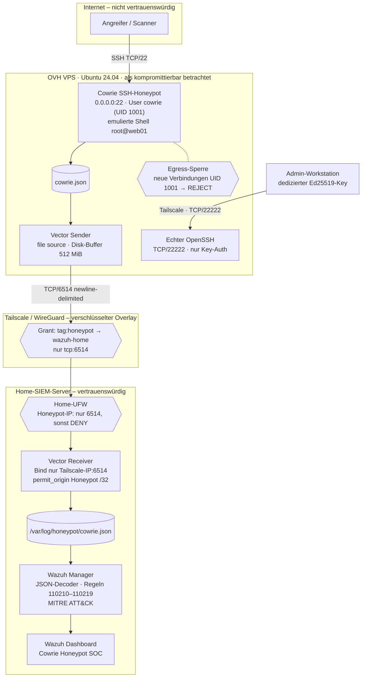

# Cowrie-Honeypot mit segmentiertem Log-Forwarding in ein Home-SIEM (Wazuh)

**Internet-exponierter SSH-Honeypot auf einem OVH-VPS, dessen Telemetrie über einen richtungsbeschränkten, Tailscale/WireGuard-verschlüsselten Log-Pfad an ein privates Wazuh-SIEM geliefert wird – mit Custom Detection Rules, MITRE-ATT&CK-Mapping, prozessbezogener Egress-Eindämmung und vom Honeypot getrennter Administration.**

| | |
|---|---|
| **Status** | Phase 1 (Infrastruktur) abgeschlossen und verifiziert · Phase 2 (Detection Engineering, Analyse, Dashboard) in Arbeit |
| **Zeitraum Phase 1** | 23.09.2026 (Aufbau, Tests, Live-Schaltung, Reboot-Acceptance-Test) |
| **Stack** | Ubuntu 24.04.5 LTS · Cowrie 3.0.15 · Vector 0.58.0 · Tailscale 1.102.4 · Wazuh 4.14.7 · UFW/iptables · systemd |

---

## Inhalt

- [Überblick](#überblick)
- [Projektziele](#projektziele)
- [Architektur](#architektur)
- [Threat Model](#threat-model)
- [Phase 1 – Sichere Honeypot- und SIEM-Infrastruktur](#phase-1--sichere-honeypot--und-siem-infrastruktur)
- [Detection Engineering](#detection-engineering)
- [Security Controls](#security-controls)
- [Validierung / Tests](#validierung--tests)
- [Beobachtete Aktivität](#beobachtete-aktivität)
- [Troubleshooting & Lessons Learned](#troubleshooting--lessons-learned)
- [Bekannte Einschränkungen](#bekannte-einschränkungen)
- [Phase 2 – Detection Engineering, Threat Analysis und SOC Dashboarding](#phase-2--detection-engineering-threat-analysis-und-soc-dashboarding)
- [Repository-Struktur](#repository-struktur)
- [Skills Demonstrated](#skills-demonstrated)
- [Disclaimer / Ethik](#disclaimer--ethik)

---

## Überblick

Dieses Projekt betreibt einen **Cowrie-SSH-Honeypot** auf einem öffentlich erreichbaren VPS und leitet dessen strukturierte JSON-Telemetrie an ein bestehendes **Wazuh-SIEM im Heimnetz** weiter. Der Honeypot ist bewusst dem Internet ausgesetzt – das eigentliche Sicherheitsproblem ist daher nicht „Wie installiere ich Cowrie?", sondern: **Wie verbinde ich ein System, das jederzeit kompromittiert werden könnte, mit einem vertrauenswürdigen SIEM, ohne dem Angreifer einen Weg ins Heimnetz zu öffnen?**

Die Antwort ist eine Defense-in-Depth-Architektur: Der VPS wird von Anfang an als **nicht vertrauenswürdig** behandelt. Er kennt keine Wazuh-Credentials, ist im Tailnet über eine Tag-Identität auf genau **einen Port** beschränkt (TCP/6514 zum Log-Receiver), wird zusätzlich durch die Home-Firewall und den Receiver selbst eingeschränkt, und der Honeypot-Prozess darf keine neuen ausgehenden Verbindungen aufbauen. Die echte Administration des VPS läuft getrennt vom Honeypot ausschließlich über Tailscale. Alle Kontrollen wurden mit konkreten Tests nachgewiesen, einschließlich eines Reboot-Acceptance-Tests – und der Honeypot hat bereits reale, unaufgeforderte Internet-Aktivität erfasst, die in Wazuh als Custom-Alerts mit MITRE-Mapping erscheint.

## Projektziele

1. **Sichere Exposition:** Ein SSH-Honeypot auf dem öffentlichen Port 22, während der echte SSH-Dienst nicht öffentlich erreichbar ist.
2. **Richtungsbeschränktes Log-Forwarding:** Der Honeypot darf ausschließlich Logs an einen einzigen Receiver-Port liefern – keine sonstigen Pfade ins Heimnetz.
3. **Keine Vertrauensbeziehung:** Keine Wazuh-Agent-Enrollment-Secrets, keine API-Credentials, keine Home-SSH-Keys auf dem VPS.
4. **Eindämmung:** Der Honeypot darf nicht zur Angriffsplattform gegen Dritte oder gegen lokale Dienste werden.
5. **SIEM-Integration:** Cowrie-JSON wird in Wazuh dekodiert und durch eigene Regeln mit MITRE-ATT&CK-Bezug klassifiziert.
6. **Nachweisbarkeit:** Jede Sicherheitsbehauptung ist durch einen reproduzierbaren Test belegt.

## Architektur



**Zwei strikt getrennte Pfade:**

| Pfad | Weg | Erreichbar für |
|---|---|---|
| Honeypot | Internet → `<HONEYPOT_PUBLIC_IP>`:22 → Cowrie (emulierte Shell) | jeden |
| Administration | Admin-Workstation → Tailscale → `<HONEYPOT_TAILSCALE_IP>`:22222 → echter OpenSSH | nur die Admin-Tailscale-IP, nur über `tailscale0` |
| Telemetrie | Cowrie → Vector → Tailscale → `<WAZUH_TAILSCALE_IP>`:6514 → Vector → Datei → Wazuh | nur der Honeypot, nur dieser Port |

Eine ausführliche Beschreibung inkl. Port-Matrix und Sequenzdiagramm steht in [`docs/architecture.md`](docs/architecture.md).

> **Begriffsklärung „One-Way":** Das ist **keine physische Data Diode**. TCP benötigt Pakete in beide Richtungen (z. B. ACKs). Korrekt ist: **logisch bzw. richtungsbeschränktes Log-Forwarding** – der Honeypot darf genau eine Verbindung zu genau einem Port *initiieren*; alle anderen Pfade sind durch mehrere unabhängige Kontrollen gesperrt.

> **Verschlüsselung:** Die Logs laufen als **TCP/6514 innerhalb eines Tailscale/WireGuard-verschlüsselten Tunnels**. Auf Anwendungsebene ist **kein TLS** konfiguriert (Port 6514 wird von Tools lediglich mit dem IANA-Namen „syslog-tls" angezeigt).

## Threat Model

Kurzfassung – vollständig in [`docs/threat-model.md`](docs/threat-model.md).

- **Grundannahme:** Der Honeypot-VPS kann kompromittiert werden. Eine Kompromittierung des Honeypots darf **nicht** zu einer Kompromittierung des Heimnetzes führen.
- **Keine Credentials auf dem Honeypot:** kein Wazuh-Agent, keine Enrollment-Secrets, keine Wazuh-API-/Dashboard-Zugangsdaten, keine SSH-Keys des Home-Servers. Der VPS kennt nur das Ziel `<WAZUH_TAILSCALE_IP>:6514`.
- **Kein Zugriff auf sensible Home-Dienste:** SSH (22), Dashboard (443), Agent-Ports (1514/1515) und Wazuh-API (55000) sind vom Honeypot aus nachweislich nicht erreichbar.
- **Nur der benötigte Log-Pfad:** Tailscale-Grant, Home-UFW, Receiver-Bind und `permit_origin` erlauben unabhängig voneinander nur TCP/6514 von genau dieser Quelle.
- **Egress Containment:** Der Linux-User `cowrie` darf keine neuen ausgehenden Verbindungen aufbauen – weder ins Internet noch zu lokalen Diensten.
- **Getrennter echter SSH-Dienst:** Die Administration ist vom Honeypot-Port getrennt und nur über Tailscale von einer einzigen Admin-IP erreichbar.
- **Grenze des Modells:** Ein **vollständiger Root-Compromise des VPS** ist ein stärkeres Szenario. Ein Angreifer mit Root könnte die lokalen Firewall-Regeln entfernen. Dagegen schützen weiterhin die **externen** Kontrollen (Tailscale-Policy, Home-UFW, Receiver-Restriktionen) – nicht aber gegen Missbrauch des VPS selbst oder gegen das Einspeisen gefälschter Log-Daten.

## Phase 1 – Sichere Honeypot- und SIEM-Infrastruktur

Alle folgenden Punkte wurden umgesetzt **und** getestet. Die vollständigen Schritt-für-Schritt-Befehle stehen in [`docs/installation.md`](docs/installation.md), die Härtungsbegründungen in [`docs/hardening.md`](docs/hardening.md), der chronologische Ablauf inkl. verworfener Zwischenstände in [`docs/timeline.md`](docs/timeline.md).

### A. VPS und Basis-Hardening

| Maßnahme | Umsetzung | Warum |
|---|---|---|
| Plattform | OVH VPS (kleiner Einstiegstarif, ca. 40 GB Disk), Ubuntu Server 24.04.5 LTS | Hetzner hatte zum Zeitpunkt keine Kapazität; OVH erlaubt einen passiven Honeypot, verbietet aber Angriffe/Scans von der Plattform aus → Eindämmung ist Pflicht, nicht Kür. |
| Patchstand | `apt update && apt full-upgrade` (kein Release-Upgrade) | Das echte OS unter einem absichtlich exponierten Dienst muss vollständig gepatcht sein. |
| Admin-Key | dedizierter Ed25519-Key (`ssh-keygen -t ed25519 -a 100`) mit Passphrase | Kein Wiederverwenden eines bestehenden RSA-Keys auf einem absichtlich angegriffenen System. |
| SSH-Härtung | `PermitRootLogin no`, `PasswordAuthentication no`, `KbdInteractiveAuthentication no`, `PubkeyAuthentication yes` in `sshd_config.d/00-…` | Das OVH-Image erlaubte anfangs Passwort-Login. Präfix `00-`, weil OpenSSH den **ersten** gefundenen Wert nutzt. Aktiviert erst **nach** erfolgreichem Key-Test in einer zweiten Sitzung. |
| Firewall | UFW `default deny incoming`, `default allow outgoing`; 22/tcp zunächst **temporär** für den echten SSH-Dienst | Minimale eingehende Angriffsfläche; Egress wird später gezielt prozessbezogen eingeschränkt, statt pauschal (das hätte Tailscale/apt/DNS gebrochen). |
| Zeitzone | UTC | Einheitliche Zeitstempel für Korrelation zwischen Cowrie und Wazuh. |
| Tailscale | Installation über das offizielle APT-Repository, **Beitritt erst nach** Anpassung der Tailnet-Policy | Ein ungefilterter Beitritt hätte dem Honeypot kurzzeitig Zugriff auf das gesamte Tailnet gegeben. |

### B. Tailscale-Segmentierung

Die Default-Policy des Tailnets (`* → * : *`) wurde **vor** dem Beitritt des VPS ersetzt ([`configs/tailscale/policy.hujson`](configs/tailscale/policy.hujson)):

- Benutzergeräte behalten ihr Verhalten (`autogroup:member → *`).
- Der VPS tritt mit einem **einmalig verwendbaren, vorab genehmigten Auth-Key mit `tag:honeypot`** bei. Dadurch hat er eine **Tag-Identität statt einer Benutzer-Identität** und erbt die breite Member-Regel nicht.
- Einziger Grant: `tag:honeypot → wazuh-home : tcp:6514`.
- **Policy-Tests** sichern ab, dass 6514 erlaubt und 22/443/1514/1515/55000 verboten bleiben – Tailscale lehnt künftige Policy-Änderungen ab, die das verletzen.
- Der Auth-Key wurde per `read -rsp` eingelesen, damit er nicht in der Shell-History landet.

**Verifiziert mit `nc` vom VPS aus:** 22, 443, 1514, 1515, 55000 → `timed out`; 6514 → vor Installation des Receivers `Connection refused` (Pfad erlaubt, kein Dienst), danach `succeeded`.

### C. Home-Server-Firewall

UFW auf dem Home-Server (vorher inaktiv) mit zwei geordneten Regeln ([`configs/firewall/home/ufw-rules.sh`](configs/firewall/home/ufw-rules.sh)):

1. `allow in on tailscale0 from <HONEYPOT_TAILSCALE_IP> to <WAZUH_TAILSCALE_IP> port 6514 proto tcp`
2. `deny in on tailscale0 from <HONEYPOT_TAILSCALE_IP>`

**Bewusste Designentscheidung:** Die globale Policy blieb vorerst `allow incoming`. Der Home-Server bedient bereits ein bestehendes Wazuh-Lab (Agents auf 1514/1515, Dashboard, API, SSH). Ein sofortiges `default deny` ohne Inventarisierung legitimer Quellen hätte dieses Lab beschädigen können. Die Honeypot-Identität ist dennoch vollständig eingeschränkt; die Umstellung des gesamten Servers auf default-deny ist ein separater, geplanter Härtungsschritt.

### D. Vector-Receiver auf dem Home-Server

[`configs/vector/vector-receiver.yaml`](configs/vector/vector-receiver.yaml): `socket`-Source im TCP-Modus, **Bind ausschließlich an `<WAZUH_TAILSCALE_IP>:6514`** (verifiziert: `ss` zeigt nicht `0.0.0.0:6514`), `permit_origin` = Honeypot-Tailscale-IP `/32`, newline-delimited Framing mit 1-MiB-Frame-Limit, `bytes`-Decoding und `raw_message`-Encoding in `/var/log/honeypot/cowrie.json`.

**Sicherheitsvorteil:** Der Receiver ist weder im LAN noch auf anderen Interfaces erreichbar und prüft die Quelle selbst noch einmal – eine vierte, unabhängige Schicht hinter Tailscale-Grant und Home-UFW. Die Rohdaten bleiben unverändert (keine Parser-Logik auf der Empfangsseite, die ein Angreifer mit präparierten Logzeilen ansprechen könnte).

### E. Wazuh-Ingestion

Wazuh liest `/var/log/honeypot/cowrie.json` mit `log_format json` und dem Label `@source = cowrie-honeypot` ([`wazuh/ossec-localfile.xml`](wazuh/ossec-localfile.xml)). **Verifiziert:** `wazuh-logtest` dekodiert alle Felder (`eventid`, `src_ip`, `username`, `input`, `session`, …); Live-Alerts enthalten `decoder.name = json`, `location = /var/log/honeypot/cowrie.json` und `data.@source = cowrie-honeypot`.

### F. Custom Wazuh Rules

Siehe [Detection Engineering](#detection-engineering). Pipeline-Testregeln `110200/110201` bewiesen die Kette VPS → Wazuh-Alert **vor** der Installation von Cowrie; die Cowrie-Regeln `110210–110219` klassifizieren reale Ereignisse.

### G. Cowrie-Installation (nativ, nicht Docker)

- **Nativ statt Docker:** Ursprünglich war ein Container geplant. Veröffentlichte Docker-Ports können UFW-Regeln umgehen; da die gesamte Sicherheitslogik auf UFW/iptables und Tailscale beruht, wurde Cowrie nativ als unprivilegierter User betrieben.
- Dedizierter User `cowrie` (UID 1001, deaktiviertes Passwort), Installation unter `/opt/cowrie`, Virtualenv `/opt/cowrie/cowrie-env`, Installation per `pip install cowrie`, State-Initialisierung mit `cowrie init`.
- Versionen laut Startlog: **Cowrie 3.0.15**, **Python 3.12.3**, **Twisted 26.4.0**, Output-Engine **jsonlog**.
- Minimale Konfiguration ([`configs/cowrie/cowrie.cfg`](configs/cowrie/cowrie.cfg)): Sensorname `honeypot-vps`, emulierter Hostname `web01`, Telnet aus.
- Zunächst lokal auf **TCP/2222** getestet (öffentlich per UFW nie freigegeben). Beobachtete Event-Typen: `cowrie.session.connect`, `cowrie.client.version`, `cowrie.client.kex`, `cowrie.login.success`, `cowrie.client.size`, `cowrie.client.var`, `cowrie.session.params`, `cowrie.command.input`, `cowrie.command.failed`, `cowrie.log.closed`, `cowrie.session.closed`.

> **`root@web01` ist die emulierte Cowrie-Shell, nicht der echte VPS.** Ein `cowrie.login.success` bedeutet nur, dass Cowrie die simulierten Credentials akzeptiert hat – kein Zugriff auf das Betriebssystem des VPS.

### H. Cowrie als systemd-Service

Der erste Service mit `cowrie start -n` scheiterte in einer Restart-Schleife (`cowrie: error: unrecognized arguments: -n`). `-n` gehört zu Twisteds `twistd`, nicht zur Cowrie-CLI. **Finale Lösung:** systemd startet `twistd -n … cowrie` direkt im Vordergrund ([`configs/systemd/cowrie.service`](configs/systemd/cowrie.service)) – als User `cowrie`, `WorkingDirectory=/opt/cowrie`, Virtualenv im `PATH`, `Restart=on-failure`, `NoNewPrivileges=true`, `PrivateTmp=true`, `ProtectHome=true`, `ProtectSystem=full`. Über mehrere Reboots hinweg verifiziert.

### I. Vector-Sender auf dem VPS

[`configs/vector/vector-sender.yaml`](configs/vector/vector-sender.yaml): `file`-Source auf `/opt/cowrie/var/log/cowrie/cowrie.json` (Checkpointing), `socket`-Sink an `<WAZUH_TAILSCALE_IP>:6514`, `raw_message`, newline-delimited, **Disk-Buffer 512 MiB** mit `when_full: block`, Healthcheck deaktiviert (Start auch bei offline Home-Server).

Zuvor wurde der Sender mit einer Testdatei (`root:vector 0640`) verifiziert – ein angehängtes Ereignis erschien ohne manuelles `nc` als Wazuh-Alert `110201`.

> **Zustellsemantik ehrlich eingeordnet:** Der `socket`-Sink arbeitet auf Anwendungsebene **best-effort** – es gibt keine End-to-End-Bestätigungen wie bei einem at-least-once-Protokoll. Der Disk-Buffer überbrückt Ausfälle des Receivers und erhöht die Robustheit, ist aber **keine garantierte Zustellung**. Ein Wechsel auf Vectors natives Protokoll mit Acknowledgements ist als optionale Erweiterung vorgesehen.

### J. Dateirechte / ACL

Vector benötigt nur **Lesezugriff** auf Cowries Logs. Statt `chmod 777` oder globaler Leserechte wurden gezielte POSIX-ACLs gesetzt: Traverse-Recht (`x`) auf `/opt/cowrie`, `/opt/cowrie/var`, `/opt/cowrie/var/log`; `rx` auf das Log-Verzeichnis, `r` auf `cowrie.json` sowie eine **Default-ACL** für künftig erzeugte Dateien (z. B. nach Log-Rotation). Der Rest des Cowrie-Baums (Konfiguration, TTY-Logs, Downloads) bleibt für Vector unzugänglich.

### K. Echten SSH vom Honeypot trennen

Ausgangslage: TCP/22 → echter OpenSSH, TCP/2222 → Cowrie (lokal). Ziel: TCP/22 → Cowrie, echter SSH auf TCP/22222 nur über Tailscale.

**Ubuntu 24.04 nutzt systemd Socket Activation für OpenSSH** – `ssh.socket` hält den Port, nicht `sshd`. Deshalb wurde ein Drop-In ([`configs/systemd/ssh.socket.d/honeypot-admin.conf`](configs/systemd/ssh.socket.d/honeypot-admin.conf)) verwendet: `ListenStream=` (geerbte Listener leeren), dann `0.0.0.0:22222` und `[::]:22222`.

- **IPv6-Problem im ersten Versuch:** Mit nur `ListenStream=22222` entstand ausschließlich `[::]:22222`. Da die Basis-Unit `BindIPv6Only=ipv6-only` setzt, wurden IPv4-Verbindungen zur Tailscale-Adresse mit `Connection refused` abgewiesen. Korrigiert durch explizite IPv4- und IPv6-Einträge.
- **Bind auf alle Adressen + UFW statt Bind an die Tailscale-IP:** vermeidet ein Boot-Order-Problem (ssh.socket vor tailscaled). UFW erlaubt 22222 **nur** `in on tailscale0` von `<ADMIN_TAILSCALE_IP>`; es gibt keine öffentliche Freigabe.
- **Reihenfolge ohne Aussperr-Risiko:** bestehende Sitzung offen lassen → Tailscale-Admin-Zugang auf 22222 in zweiter Sitzung beweisen → erst dann Cowrie auf 22 legen → UFW-Regeln mit korrektem Zweck ersetzen.

**Finale Listener:** `0.0.0.0:22` → twistd/Cowrie · `0.0.0.0:22222` und `[::]:22222` → sshd (systemd) · kein Listener mehr auf 2222.

### L. Cowrie auf dem privilegierten Port 22

Cowrie läuft weiterhin als unprivilegierter User. Statt `setcap` global auf die Python-Binary anzuwenden, erhält **nur der systemd-Dienst** die Capability ([`override.conf`](configs/systemd/cowrie.service.d/override.conf)): `AmbientCapabilities=CAP_NET_BIND_SERVICE` und `CapabilityBoundingSet=CAP_NET_BIND_SERVICE`. **Vorteil:** Die Berechtigung ist an genau einen Prozess gebunden, nicht an einen systemweit genutzten Interpreter, und das Bounding-Set schließt alle anderen Capabilities aus – insbesondere `CAP_NET_ADMIN`, sodass Cowrie die Firewall nicht verändern kann.

### M. Process-Level Egress Containment

Der Linux-User `cowrie` (UID 1001) darf **keine neuen ausgehenden Verbindungen** initiieren. Umgesetzt in `ufw-before-output` (IPv4) und `ufw6-before-output` (IPv6) ([`configs/firewall/vps/`](configs/firewall/vps/)):

```text
1. RELATED,ESTABLISHED  → ACCEPT   (Antworten in bestehenden Sitzungen)
2. --uid-owner 1001     → REJECT   (alles Neue vom cowrie-User)
3. -o lo                → ACCEPT   (Loopback für alle übrigen Prozesse)
4. normale UFW-Verarbeitung
```

| Verbindung | Ergebnis |
|---|---|
| Angreifer → Cowrie:22, Cowrie antwortet in derselben Sitzung | erlaubt |
| Cowrie → neue Internetverbindung (Test: `1.1.1.1:80`) | **REJECT** |
| Cowrie → echter SSH auf `127.0.0.1:22222` (lokaler Pivot) | **REJECT** |
| Admin-User `ubuntu` → Internet (`curl https://example.com`) | erlaubt (HTTP 200) |
| Vector → `<WAZUH_TAILSCALE_IP>:6514` | weiterhin `ESTAB` |
| tailscaled, apt | nicht betroffen |

Dies ist **Process-Level Egress Containment**. Es schützt gegen einen Angreifer, der auf den Kontext des `cowrie`-Users beschränkt ist – **nicht** gegen einen hypothetischen vollständigen Root-Compromise des VPS.

> **Konsequenz für die Telemetrie:** Emulierte Downloads (`wget`/`curl` in der Cowrie-Shell) können durch die Sperre keine Nutzdaten nachladen. Der Download-*Versuch* bleibt über das Kommando sichtbar (Regel 110215); ein tatsächlich erfasster Download (Regel 110216) ist daher selten zu erwarten. Uploads per SCP/SFTP (110217) sind davon nicht betroffen.

### N. Vector/Tailscale Boot-Race

Beim Reboot-Test nach Einführung der Egress-Regeln zeigte `ss`: `SYN-SENT <HONEYPOT_PUBLIC_IP>:44412 → <WAZUH_TAILSCALE_IP>:6514`. Vector hatte gestartet, bevor die Tailscale-Route nutzbar war; der Socket wurde über das öffentliche Interface angelegt und wechselt nachträglich nicht auf `tailscale0`. Danach funktionierten `tailscale ping`, `nc … 6514` und `ip route get` (→ `dev tailscale0 src <HONEYPOT_TAILSCALE_IP>`) einwandfrei. Da kein Handshake zustande kam, wurden keine Logdaten über das öffentliche Interface übertragen.

**Fix:** Drop-In [`vector.service.d/tailscale-readiness.conf`](configs/systemd/vector.service.d/tailscale-readiness.conf) mit `After=`/`Wants=tailscaled.service` **und** einem `ExecStartPre`, das bis zu ~60 s prüft, ob `<WAZUH_TAILSCALE_IP>` über `tailscale0` geroutet wird. **Nach erneutem Reboot verifiziert:** `ESTAB <HONEYPOT_TAILSCALE_IP>:46050 → <WAZUH_TAILSCALE_IP>:6514`.

### O. Live-Internet-Test

Nach der Umstellung wurde der Honeypot aus dem Internet erreicht:

- **Kontrollierter Eigentest** von einer externen IP (Windows-Client, Fake-Passwort): `whoami`, `id`, `uname -a`, `pwd`, `exit` → in Wazuh als Regel **110214** (Level 5, **MITRE T1059**) mit externer `src_ip` statt `127.0.0.1`.
- **Unaufgeforderte reale Aktivität:** Bereits während der Tests zeigte `ss` etablierte Verbindungen externer Quellen auf Cowrie:22. Eine externe Quelle (`ATTACKER-IP-01`) wurde von Cowrie akzeptiert und führte `echo xsec` aus – unabhängig von den Eigentests durch dieselbe Pipeline erkannt.

### P. Reboot- / Persistenz-Tests (Acceptance Test Phase 1)

Nach dem finalen Reboot verifiziert ([`scripts/vps-healthcheck.sh`](scripts/vps-healthcheck.sh)):

| Prüfung | Ergebnis |
|---|---|
| `systemctl is-active cowrie vector tailscaled` | `active` / `active` / `active` |
| Listener | TCP/22 → twistd (Cowrie) · TCP/22222 → sshd (IPv4 + IPv6) |
| `ip route get <WAZUH_TAILSCALE_IP>` | `dev tailscale0 … src <HONEYPOT_TAILSCALE_IP>` |
| Vector-Verbindung | `ESTAB <HONEYPOT_TAILSCALE_IP> → <WAZUH_TAILSCALE_IP>:6514` |
| Egress-Regel IPv4 / IPv6 | `--uid-owner 1001 -j REJECT` aktiv |
| Containment-Test | `GOOD` (Cowrie → 1.1.1.1:80 abgewiesen) |

## Detection Engineering

Regeldatei: [`wazuh/rules/cowrie_rules.xml`](wazuh/rules/cowrie_rules.xml) · Tests: [`wazuh/logtest/`](wazuh/logtest/)

| ID | Level | Auslöser (`eventid` / Feld) | MITRE | Status |
|---|---|---|---|---|
| 110200 | 3 | `lab.*` (Pipeline-Test) | – | verifiziert (logtest + live) |
| 110201 | 5 | `lab.wazuh.test` | – | verifiziert (logtest + live, `nc` und Vector-Sender) |
| 110210 | 0 | `cowrie.*` – Basis, `noalert` | – | implizit verifiziert (Kind-Regeln feuern) |
| 110211 | 3 | `cowrie.session.connect` | – | **live verifiziert** (reale Internet-Quellen) |
| 110212 | 4 | `cowrie.login.failed` | – | definiert, nicht als Alert belegt |
| 110213 | 7 | `cowrie.login.success` (Cowrie-akzeptiert) | – | **live verifiziert** |
| 110214 | 5 | `cowrie.command.input` | T1059 | **live verifiziert** (Eigentest + reale Quelle) |
| 110215 | 8 | Kind von 110214: `input` enthält `wget\|curl\|tftp\|ftpget` | T1105 | definiert, noch nicht verifiziert |
| 110216 | 10 | `cowrie.session.file_download` | T1105 | definiert, noch nicht beobachtet |
| 110217 | 10 | `cowrie.session.file_upload` | T1105 | definiert, noch nicht beobachtet |
| 110218 | 4 | `cowrie.command.failed` | – | definiert; Events beobachtet, Alert nicht belegt |
| 110219 | 8 | 5× 110212 derselben `src_ip` in 120 s | T1110 | definiert, noch nicht verifiziert |

**Designentscheidungen:**

- **Eigener ID-Bereich 1102xx:** Die zuerst geplanten IDs `100200/100201` kollidierten mit einer bestehenden Regel eines früheren Labs (`Rule ID '100200' is duplicated`).
- **Hierarchie über `if_sid`:** Eine Basisregel ohne Alert klassifiziert alle `cowrie.*`-Events; spezifische Kind-Regeln vergeben Level und MITRE-Technik. Da 110215 ein Kind von 110214 ist, erhält ein `wget`-Kommando die höhere Einstufung 110215 statt 110214.
- **Keine Passwörter in Alert-Beschreibungen:** Cowrie protokolliert versuchte Passwörter; sie bleiben als Feld durchsuchbar, landen aber nicht in Titeln/Beschreibungen.
- **Test vor Deployment:** Regeln werden mit `wazuh-logtest` geprüft, bevor der Manager neu gestartet wird.

## Security Controls

| Control | Zweck | Status |
|---|---|---|
| SSH-Key-Authentifizierung (dedizierter Ed25519-Key, Passphrase) | Kein Passwort-Login am echten SSH; kein Key-Reuse | Verifiziert (`sshd -T`, Key-Login mit Passphrase) |
| Root-Login / Password / Keyboard-Interactive deaktiviert | Angriffsfläche des echten SSH minimieren | Verifiziert (`sshd -T`) |
| Echter SSH nur auf TCP/22222 über Tailscale | Administration vom Honeypot-Port trennen | Verifiziert |
| Tailscale Tag-Identität + Grant `tcp:6514` | Honeypot erreicht nur den Log-Receiver | Verifiziert (`nc`-Tests) |
| Tailscale-Policy-Tests | Regression bei künftigen Policy-Änderungen verhindern | Konfiguriert (Policy ließ sich speichern) |
| UFW VPS: default deny incoming, 22 öffentlich, 22222 nur tailscale0 + Admin-IP | Minimale Exposition | Verifiziert |
| Home-UFW: Honeypot nur 6514, sonst deny | Zweite, von Tailscale unabhängige Schicht | Konfiguriert und aktiv (isoliert nicht getestet, s. Einschränkungen) |
| Vector-Receiver: Bind nur Tailscale-IP | Receiver nicht im LAN/auf anderen Interfaces | Verifiziert (`ss`) |
| Vector `permit_origin` /32 | Quellprüfung im Receiver selbst | Konfiguriert |
| Frame-/Zeilenlimit 1 MiB | Schutz vor übergroßen, angreiferkontrollierten Zeilen | Konfiguriert |
| Keine Wazuh-Credentials/-Agent auf dem Honeypot | Kein Vertrauensanker auf untrusted System | Umgesetzt (Architektur) |
| Cowrie als unprivilegierter User, systemd-Sandboxing | Schadensbegrenzung bei Cowrie-Schwachstelle | Verifiziert (Dienst läuft als `cowrie`) |
| `CAP_NET_BIND_SERVICE` nur per systemd (kein globales `setcap`) | Minimal-Privileg für Port 22 | Verifiziert (Cowrie auf :22) |
| UID-basiertes Egress-Blocking (IPv4 + IPv6) | Honeypot nicht als Angriffsplattform / kein lokaler Pivot | Verifiziert (inkl. Reboot) |
| Gezielte ACLs statt globaler Leserechte | Vector liest nur die Logs | Verifiziert (Events kommen an) |
| Vector-Disk-Buffer 512 MiB | Überbrückung von Receiver-Ausfällen (keine Zustellgarantie) | Konfiguriert |
| Vector-Start erst bei Tailscale-Route | Boot-Race verhindern | Verifiziert (Reboot) |
| Wazuh Custom Rules 110210–110219 | Klassifikation der Honeypot-Aktivität | Teilweise live verifiziert (s. Tabelle oben) |
| MITRE-ATT&CK-Mapping (T1059, T1105, T1110) | Einordnung in Angriffstechniken | T1059 live verifiziert; T1105/T1110 definiert |

## Validierung / Tests

Vollständige Testmatrix mit Befehlen und Originalausgaben: [`docs/validation.md`](docs/validation.md).

| # | Test | Erwartung | Ergebnis |
|---|---|---|---|
| T01 | VPS → Home TCP 22/443/1514/1515/55000 (`nc -zvw3`) | blockiert | `timed out` ✔ |
| T02 | VPS → Home TCP/6514 vor Receiver-Installation | Pfad erlaubt, kein Dienst | `Connection refused` ✔ |
| T03 | VPS → Home TCP/6514 nach Receiver-Installation | erreichbar | `succeeded` ✔ |
| T04 | Receiver-Bind | nur Tailscale-IP | `<WAZUH_TAILSCALE_IP>:6514`, nicht `0.0.0.0` ✔ |
| T05 | Test-JSON per `nc` → Datei → `wazuh-logtest` → Live-Alert | Alert 110201 | ✔ |
| T06 | Vector-Sender automatisch (ohne `nc`) → Wazuh | Alert 110201 | ✔ |
| T07 | Echte Cowrie-Events (lokal) → Home-Datei | `cowrie.*` kommen an | ✔ |
| T08 | Cowrie-Kommandos → Wazuh | Alert 110214 + T1059 | ✔ |
| T09 | Echter SSH via Tailscale auf 22222 | Login auf echtem VPS | ✔ |
| T10 | Echter SSH via öffentliche IP auf 22222 | scheitert | ✔ (vom Betreiber bestätigt, ohne Log-Auszug) |
| T11 | Öffentliche IP TCP/22 | landet in Cowrie (`root@web01`) | ✔ |
| T12 | Cowrie-UID → `1.1.1.1:80` | REJECT | `Connection refused` / `GOOD` ✔ |
| T13 | Cowrie-UID → `127.0.0.1:22222` | REJECT | `GOOD` ✔ |
| T14 | Admin-User → Internet | funktioniert | HTTP 200 ✔ |
| T15 | Vector → Home nach Egress-Regeln | weiterhin verbunden | `ESTAB` ✔ |
| T16 | Externer Cowrie-Test → Wazuh | 110214 mit externer `src_ip` | ✔ |
| T17 | Reboot (vor SSH-Umzug) | Cowrie/Vector/Tailscale aktiv | ✔ |
| T18 | Reboot nach Egress-Regeln | alles aktiv, Vector verbunden | ✘ Vector `SYN-SENT` → Fix (N) |
| T19 | Reboot nach Fix (Acceptance) | alle Prüfungen grün | ✔ |

## Beobachtete Aktivität

> Alle Werte sind anonymisiert bzw. aggregiert. Es werden keine realen Angreifer-IPs, Passwörter oder URLs veröffentlicht.

**Momentaufnahme des Dashboards** (Zeitraum „Last 24 hours", wenige Stunden nach Freigabe von TCP/22; enthält auch eine kleine Zahl eigener Testverbindungen):

| Kennzahl | Wert |
|---|---|
| Verbindungen (`110211`) | 367 |
| Von Cowrie akzeptierte Logins (`110213`) | 344 |
| Beobachtete Kommandos (`110214`) | 354 |

Qualitative Beobachtungen:

- Die Aktivität setzte **unmittelbar nach der Freigabe** von TCP/22 ein.
- **Zwei externe Quellen** verursachten den Großteil der Verbindungen.
- Häufigster Benutzername war mit großem Abstand `root`, gefolgt von `ubuntu`.
- Die Passwortversuche folgten erwartbaren Mustern schwacher Standardpasswörter (Werte nicht veröffentlicht).
- Das mit Abstand häufigste Kommando war `echo xsec`. *Hypothese (in Phase 2 zu prüfen):* ein automatisierter Check, ob Kommandoausführung in der Shell funktioniert – typisch für Bots vor weiteren Schritten.

Beispiel eines Alerts (anonymisiert):

```text
rule.id: 110214 · rule.level: 5 · rule.mitre.id: T1059
data.eventid: cowrie.command.input
data.src_ip: ATTACKER-IP-01
data.username: root
data.input: echo xsec
location: /var/log/honeypot/cowrie.json
```

Eine systematische Session-Analyse mit IoCs und ATT&CK-Mapping ist Teil von Phase 2 ([`investigations/`](investigations/)).

## Troubleshooting & Lessons Learned

Ausführlich: [`docs/troubleshooting.md`](docs/troubleshooting.md) und [`docs/lessons-learned.md`](docs/lessons-learned.md).

| Problem | Ursache | Lösung |
|---|---|---|
| `cowrie start` → `FileNotFoundError` | `twistd` nicht im `PATH` (Virtualenv nicht aktiv) | venv aktivieren bzw. `PATH` im Service setzen |
| `cowrie start -n` → `unrecognized arguments: -n` | `-n` ist eine `twistd`-Option | systemd startet `twistd -n … cowrie` direkt |
| SSH auf 22222 → `Connection refused` | `ssh.socket` lauschte nur auf `[::]:22222` (`BindIPv6Only=ipv6-only`) | explizite `ListenStream` für IPv4 und IPv6 |
| Vector nach Reboot in `SYN-SENT` über Public-IP | Boot-Race: Vector vor nutzbarer Tailscale-Route | `ExecStartPre`-Routenprüfung + `After=tailscaled` |
| `Rule ID '100200' is duplicated` | ID-Kollision mit älterem Lab | eigener ID-Bereich 1102xx |
| Vector 0.58: `unknown field 'decoding'` | `file`-Source kennt kein `decoding` | Feld entfernt, `max_line_bytes` gesetzt |
| Cowrie-Felder fehlen in der Dashboard-Feldliste | veralteter Index-Pattern-Cache | *Refresh field list* |
| DQL-Fehler im Visualize-Editor | Query-Parser lehnte `rule.id:110211` ab | *Add filter* bei leerer Query |
| Befehle auf dem falschen Host ausgeführt | ähnliche Prompts/uneindeutige Hostnamen | Prompt vor jedem Schritt prüfen; Hostnamen eindeutig benennen |

## Bekannte Einschränkungen

Ehrlich dokumentierte offene Punkte (nicht Teil der verifizierten Phase-1-Aussagen):

- **Root-Compromise des VPS** ist nicht abgedeckt: Lokale Kontrollen (UID-Egress, UFW) wären dann aushebelbar; es bleiben nur die externen Grenzen. Ein kompromittierter VPS könnte zudem gefälschte Log-Zeilen senden (Log-Integrität ist nicht kryptografisch gesichert).
- **Home-UFW** steht global noch auf `allow incoming`; die Honeypot-Identität ist eingeschränkt, der restliche Server ist noch nicht auf default-deny umgestellt.
- **Schichten einzeln getestet?** Die `nc`-Tests zeigen die Wirkung des Gesamtsystems (primär Tailscale). Home-UFW und `permit_origin` wurden als aktiv bestätigt, aber nicht isoliert (bei gelockerter Tailscale-Policy) getestet.
- **Zustellung** über den `socket`-Sink ist best-effort; Disk-Buffer ≠ Zustellgarantie.
- **Kein TLS auf Anwendungsebene** – Vertraulichkeit/Integrität des Transports stützt sich auf WireGuard.
- **Log-Rotation** von `cowrie.json` (VPS) und `/var/log/honeypot/cowrie.json` (Home) wurde in Phase 1 nicht getestet bzw. nicht konfiguriert.
- **Home-Seite nach Reboot:** Der Home-Receiver bindet an die Tailscale-IP; ein Home-Reboot-Test ist nicht dokumentiert (gleiche Boot-Race-Klasse denkbar).
- **Cowrie lauscht nur auf IPv4** (`0.0.0.0:22`); die UFW-IPv6-Regel für Port 22 hat derzeit keinen Listener.
- **Automatische Sicherheitsupdates** (`unattended-upgrades`) wurden empfohlen, ihre Aktivierung ist im Projektverlauf nicht belegt.

## Phase 2 – Detection Engineering, Threat Analysis und SOC Dashboarding

> **Noch nicht abgeschlossen.** Die folgenden Punkte sind geplant bzw. teilweise begonnen. Details: [`docs/roadmap-phase2.md`](docs/roadmap-phase2.md).

**A. Wazuh-Dashboard „Cowrie Honeypot SOC" (begonnen)** – vorhanden: Total Connections, Successful Cowrie Logins, Commands Observed, Connections Over Time, Top Source IPs, Top Usernames, Top Passwords, Top Commands. Geplant: Unique Source IPs, Event Types, Download Commands, Files Downloaded, Recent Attacker Activity, MITRE-ATT&CK-Übersicht, Session-basierte Investigation-Panels. Siehe [`wazuh/dashboard/`](wazuh/dashboard/).

**B. Detection Engineering** – Verifikation von 110215–110219, Command-Sequenzen und Session-Korrelation, weitere verdächtige Shell-Kommandos, False-Positive-/Noise-Reduktion (z. B. eigene Test-IPs), Severity-Tuning.

**C. Real Attacker Investigation** – Analyse realer Sessions: Source IP, Zeitpunkt, Username, Passwortversuch, Session-ID, Kommandos, Downloads, Dauer, IoCs, ATT&CK-Mapping, Detection Coverage, Analyst Conclusion → professioneller Write-up in [`investigations/`](investigations/).

**D. MITRE ATT&CK Mapping** – beobachtete Aktivität systematisch Techniken zuordnen, nicht nur Regeln.

**E. Dashboard und Screenshots** – anonymisierte Screenshots von Dashboard, Alerts, Regeln, MITRE-Mapping, öffentlichem Cowrie-Listener, Tailscale-only-SSH, Egress-Containment und Pipeline ([`screenshots/`](screenshots/)).

**F. Optionale Erweiterungen** – Vector-natives Protokoll mit Acknowledgements, TLS innerhalb des Tunnels, zusätzliche Alert-Korrelation, GeoIP-/ASN-/Länder-Anreicherung, Threat-Intelligence-Anreicherung, automatisierte IoC-Extraktion, Reporting, weitere Honeypot-Protokolle, sicherer Umgang mit erfassten Samples (nur Hashes/Metadaten, **keine Ausführung von Malware**).

## Repository-Struktur

```text
cowrie-honeypot-lab/
├── README.md
├── SECURITY.md                      # Veröffentlichungs- und Anonymisierungsregeln
├── configs/
│   ├── cowrie/cowrie.cfg
│   ├── vector/                      # Sender (VPS) + Receiver (Home)
│   ├── ssh/00-honeypot-hardening.conf
│   ├── systemd/                     # cowrie.service + Drop-Ins (Capabilities, ssh.socket, Vector-Readiness)
│   ├── firewall/vps/                # UFW-Regeln, before(6).rules-Ausschnitte, Egress-Skript
│   ├── firewall/home/               # Home-UFW
│   └── tailscale/policy.hujson
├── wazuh/
│   ├── rules/                       # cowrie_rules.xml, lab_pipeline_rules.xml
│   ├── ossec-localfile.xml
│   ├── logtest/                     # Regeltests
│   └── dashboard/                   # Panel-Spezifikation (Phase 2: NDJSON-Export)
├── samples/                         # bereinigte Beispiel-Events
├── scripts/                         # Health-Check und Segmentierungstest
├── investigations/                  # Phase 2: Session-Analysen + Vorlage
├── screenshots/                     # nur anonymisierte Screenshots
└── docs/
    ├── architecture.md
    ├── threat-model.md
    ├── installation.md
    ├── hardening.md
    ├── validation.md
    ├── troubleshooting.md
    ├── lessons-learned.md
    ├── timeline.md
    └── roadmap-phase2.md
```

## Skills Demonstrated

- **Linux-Administration:** Ubuntu 24.04, systemd-Units und Drop-Ins, Socket Activation, POSIX-ACLs, Virtualenvs
- **Network Security & Firewalling:** UFW, iptables/ip6tables-Owner-Match, Stateful-Filtering-Reihenfolge, IPv4/IPv6-Dual-Stack
- **Zero-Trust-Segmentierung:** Tailscale/WireGuard, Tag-Identitäten, Grants, Policy-Tests
- **SIEM Engineering:** Wazuh-Logcollector, JSON-Decoding, Index-Pattern, Dashboards
- **Detection Engineering:** Regelhierarchien, Korrelationsregeln, `wazuh-logtest`, MITRE ATT&CK
- **Log-Pipelines:** Vector (file/socket Source & Sink, Framing, Disk-Buffer, Zustellsemantik)
- **Honeypot-Betrieb:** Cowrie (Installation, Konfiguration, Event-Modell)
- **Threat Modeling & Containment:** Trust Boundaries, Least Privilege, Capabilities, Egress Control
- **Troubleshooting:** systematische Fehlersuche (Boot-Races, IPv6-only-Sockets, CLI-Inkompatibilitäten)
- **Incident Analysis** (in Aufbau, Phase 2)

## Disclaimer / Ethik

- Der Honeypot läuft ausschließlich auf **eigener, gemieteter Infrastruktur** und empfängt **passiv** unaufgeforderte Verbindungen.
- Es finden **keine aktiven Gegenangriffe**, **keine Scans fremder Systeme** und **keine Penetrationstests gegen Dritte** statt. Die Egress-Sperre verhindert zusätzlich, dass der Honeypot-Prozess Verbindungen zu Dritten aufbaut.
- Erfasste Dateien werden **niemals ausgeführt**; eine Analyse erfolgt – wenn überhaupt – nur über Hashes/Metadaten bzw. in isolierten Umgebungen.
- Gesammelte Daten werden **ausschließlich defensiv** analysiert.
- IP-Adressen, Credentials und sonstige identifizierende Daten werden vor der Veröffentlichung **anonymisiert** (siehe [`SECURITY.md`](SECURITY.md)).
- Die Nutzungsbedingungen des Hosting-Providers wurden vor dem Betrieb geprüft; der Aufbau ist auf einen passiven Sensor ausgelegt.
