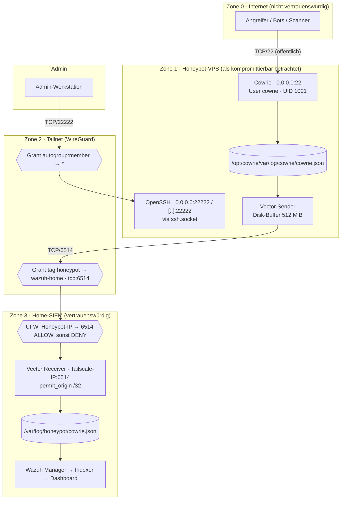
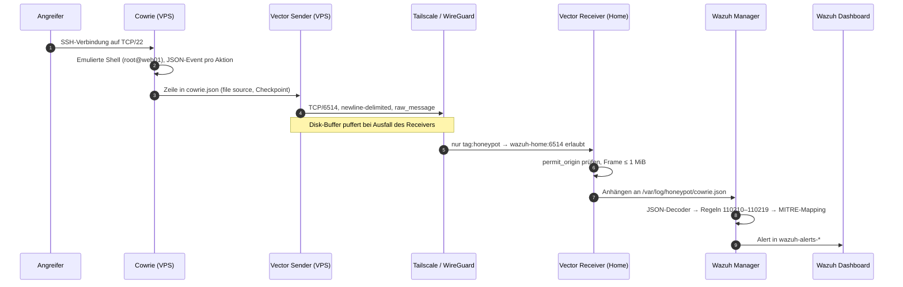

# Architektur

Dieses Dokument beschreibt den **finalen, verifizierten Zustand** nach Phase 1.
Verworfene Zwischenstände sind in [`timeline.md`](timeline.md) und [`troubleshooting.md`](troubleshooting.md) dokumentiert.

## 1. Komponenten

| System | Rolle | Vertrauensstufe | Wesentliche Software |
|---|---|---|---|
| **Honeypot-VPS** (OVH, kleiner Einstiegstarif) | Internet-exponierter Sensor | **nicht vertrauenswürdig** – gilt als kompromittierbar | Ubuntu 24.04.5 LTS, Cowrie 3.0.15 (Python 3.12.3, Twisted 26.4.0), Vector 0.58.0, Tailscale 1.102.4, UFW |
| **Home-SIEM-Server** | Log-Senke, SIEM, Dashboard | vertrauenswürdig | Wazuh 4.14.7 (Manager, Indexer, Dashboard – bestehende Installation), Vector (Receiver), Tailscale, UFW |
| **Admin-Workstation** | Administration des VPS | vertrauenswürdig | OpenSSH-Client, dedizierter Ed25519-Key, Tailscale |
| **Tailnet** | verschlüsselter Overlay zwischen den Systemen | Transport, durch Policy eingeschränkt | Tailscale / WireGuard |

## 2. Gesamtbild



## 3. Datenfluss eines Ereignisses



## 4. Port- und Verbindungsmatrix

### Eingehend auf dem Honeypot-VPS

| Port | Dienst | Listener | Öffentlich (Internet) | Über tailscale0 |
|---|---|---|---|---|
| TCP/22 | Cowrie (twistd) | `0.0.0.0:22` | **erlaubt** | – |
| TCP/22222 | echter OpenSSH (ssh.socket) | `0.0.0.0:22222`, `[::]:22222` | blockiert (UFW) | nur von `<ADMIN_TAILSCALE_IP>` |
| TCP/2222 | – (früherer Cowrie-Testport) | kein Listener | blockiert | – |
| UDP/41641 | tailscaled | `0.0.0.0` / `[::]` | – (Tailscale-Transport) | – |
| alles andere | – | – | blockiert (default deny) | blockiert (default deny) |

### Ausgehend vom Honeypot-VPS

| Quelle | Ziel | Ergebnis |
|---|---|---|
| Cowrie (UID 1001), Antwort in bestehender Sitzung | Angreifer | erlaubt (RELATED,ESTABLISHED) |
| Cowrie (UID 1001), neue Verbindung | Internet / localhost / Tailnet | **REJECT** |
| Vector | `<WAZUH_TAILSCALE_IP>`:6514 | erlaubt |
| Honeypot (tag:honeypot) | Home 22 / 443 / 1514 / 1515 / 55000 | **blockiert** (Tailscale, zusätzlich Home-UFW) |
| Honeypot (tag:honeypot) | andere Tailnet-Geräte | blockiert (kein Grant) |
| tailscaled, apt, Admin-User | Internet | erlaubt |

### Eingehend auf dem Home-Server (relevanter Ausschnitt)

| Quelle | Ziel | Ergebnis |
|---|---|---|
| `<HONEYPOT_TAILSCALE_IP>` über tailscale0 | `<WAZUH_TAILSCALE_IP>`:6514 | erlaubt |
| `<HONEYPOT_TAILSCALE_IP>` über tailscale0 | alles andere | **DENY** |
| Internet / LAN | TCP/6514 | kein Listener (Bind nur an Tailscale-IP) |
| übrige Quellen | bestehende Wazuh-Dienste | unverändert (Home-UFW default allow – bewusst, siehe [`hardening.md`](hardening.md)) |

## 5. Kontrollschichten auf dem Log-Pfad

Der einzige Pfad vom Honeypot ins Heimnetz wird durch **vier unabhängige Kontrollen** eingeschränkt:

```text
Honeypot (tag:honeypot)
   │
   ├─ 1. Tailscale-Grant:     nur tcp:6514 zu wazuh-home (deny-by-default)
   ├─ 2. Home-UFW:            Quelle = Honeypot-IP → nur 6514, danach DENY
   ├─ 3. Vector-Bind:         lauscht nur auf der Tailscale-IP, nicht auf 0.0.0.0
   └─ 4. Vector permit_origin: akzeptiert nur Honeypot-IP /32
          │
          ▼
   /var/log/honeypot/cowrie.json  →  Wazuh
```

Fällt eine Schicht durch Fehlkonfiguration weg (z. B. versehentliche Lockerung der Tailscale-Policy), bleiben die anderen wirksam.

## 6. Warum kein Wazuh-Agent auf dem Honeypot?

Ein Wazuh-Agent würde Enrollment (TCP/1515) und Agent-Kommunikation (TCP/1514) benötigen und den VPS zu einem **vertrauenswürdigen Agenten** des Managers machen. Stattdessen:

- Der VPS schreibt nur Log-Zeilen in einen TCP-Socket.
- Der Manager liest eine **lokale Datei** (`localfile`, `log_format json`).
- Auf dem VPS liegen **keine** Agent-Keys, Enrollment-Passwörter, API-Tokens oder Dashboard-Credentials.

## 7. Verschlüsselung und Begriffe

- **Transport:** TCP/6514 innerhalb des **Tailscale/WireGuard-Tunnels**. Kein zusätzliches TLS auf Anwendungsebene (optionale Erweiterung, siehe Roadmap).
- **„One-Way":** keine physische Data Diode, sondern **richtungsbeschränktes Log-Forwarding** – der Honeypot darf genau eine Verbindung initiieren; TCP-Antworten (ACKs) fließen naturgemäß zurück.
- **Zustellung:** best-effort auf Anwendungsebene; der Disk-Buffer verbessert die Robustheit, garantiert aber keine Zustellung.
