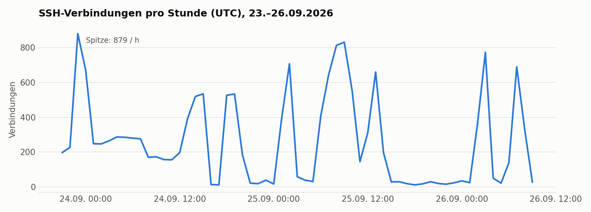
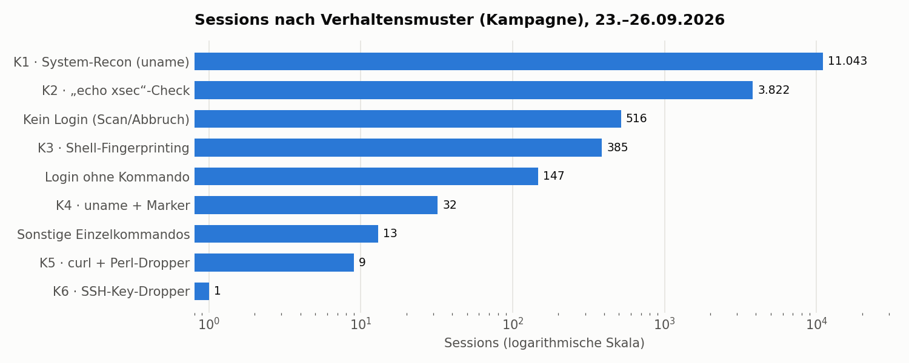

# Angriffsstatistik – erste Auswertung (Phase 2)

**Zeitraum:** 23.09.2026, 21:02 UTC – 26.09.2026, 09:49 UTC (≈ 61 Stunden)
**Datenbasis:** vollständige Cowrie-Rohdaten vom Home-Server (`/var/log/honeypot/cowrie.json`, 128.810 Events) und Wazuh-Alerts
**Bereinigung:** eigene Testverbindungen (lokal und extern) herausgerechnet. Quell-IPs erscheinen nur als Labels oder als Anzahl, Passwörter nur aggregiert.

> Ein akzeptierter Login bedeutet hier immer: **Cowrie** hat die Zugangsdaten angenommen und eine **emulierte** Shell geliefert. Kein Angreifer hatte Zugriff auf das Betriebssystem des VPS.

## 1. Kennzahlen

| Kennzahl | Wert |
|---|---|
| Verbindungen (`cowrie.session.connect`) | **15.967** |
| Unterschiedliche Quell-IPs | **251** |
| Login-Versuche | 15.498 – davon **15.452 von Cowrie akzeptiert** (99,7 %), 46 abgelehnt |
| Unterschiedliche Benutzernamen / Passwörter | 390 / 1.928 |
| Eingegebene Kommandozeilen | **16.845** – aber nur **14 unterschiedliche** |
| SSH-Client-Kennung `SSH-2.0-Go` | 15.532 Verbindungen (≈ 97 %) |
| Per Shell-Umleitung geschriebene Dateien | 772 |
| Gescheiterte Payload-Downloads | 7 (alle aus einer Kampagne, s. HP-001) – kein einziger Netz-Download erfolgreich |
| SFTP-Uploads | 3 (2 × leer, 1 × ELF-Binary 9,8 MB, s. HP-004) |
| SSH-Tunnel-/Proxy-Anfragen (`direct-tcpip`) | 108 von 5 Quellen, alle von Cowrie verworfen |
| Zeit bis zur ersten fremden Session nach Freigabe von TCP/22 | **≈ 25 Sekunden** |

**Einordnung:** Nahezu die gesamte Aktivität ist automatisiert. 16.845 Kommandozeilen mit nur 14 verschiedenen Inhalten, 97 % identische Client-Bibliothek und Session-Dauern im Bereich von Sekunden sprechen klar gegen menschliche Interaktion.

## 2. Verlauf

Die Last kommt nicht gleichmäßig, sondern in **Wellen** von mehreren hundert Verbindungen pro Stunde (Spitze 879/h). Sie entstehen fast vollständig durch die Kampagnen K1 und K2, die abwechselnd aktiv sind.

## 3. Kampagnen (nach Verhalten gruppiert)

Sessions wurden über ihr Kommandomuster gruppiert. Client-Kennung und HASSH-Fingerprint bestätigen die Gruppierung. HASSH identifiziert allerdings die **Client-Bibliothek**, nicht den Akteur: Gleiche HASSH-Werte bedeuten gleiche Werkzeuge, nicht zwingend dieselbe Gruppe.

| ID | Muster | Sessions | Quellen | Client / HASSH | Median-Dauer | Bericht |
|---|---|---|---|---|---|---|
| **K1** | `uname -s -v -n -r -m` direkt nach Login | 11.043 | 11 – davon 10 aus **einem /24-Netz** mit fast identischer Session-Zahl je IP | `SSH-2.0-Go` / `0a07365c…` | 0,7 s | – |
| **K2** | `echo xsec` | 3.822 | 3 | `SSH-2.0-Go` / `98ddc560…` | 11,3 s | – |
| **K3** | mehrstufiges Fingerprinting-Skript (Hardware, `last`, Shell-Verhalten) | 385 | 13 aus 4 /24-Netzen | `SSH-2.0-Go` / `2ec37a7c…` | 4,9 s | [HP-002](../investigations/HP-002.md) |
| **K4** | `uname -a ; echo '<Marker>'` | 32 | 2 (gleiches /24) | `16443846…` | 0,8 s | – |
| **K5** | GPU-Check + `curl` + `perl` | 9 | 1 | `SSH-2.0-libssh2_1.4.3` / `92674389…` | 22–92 s | [HP-001](../investigations/HP-001.md) |
| **K6** | Dropper mit eingebettetem SSH-Private-Key | 1 | 1 | `SSH-2.0-Go` / `16443846…` | 4,9 s | [HP-003](../investigations/HP-003.md) |
| **K7** | SSH-Port-Forwarding (`direct-tcpip`) ohne Kommandos | 108 Anfragen | 5 | verschiedene | – | – |
| **K8** | SFTP-Upload einer Datei „sshd“, Session-Timeout nach ~300 s | 3 | 3 | `SSH-2.0-Go` / `98ddc560…` | ≈ 300 s | [HP-004](../investigations/HP-004.md) |
| – | Verbindung ohne Login (Scanner, Abbruch) | 516 | 236 | u. a. ZGrab, Nmap, HTTP-Anfragen auf Port 22 | 0,05 s | – |

### Auffällige Details

- **K1 – zielgerichtete Benutzernamen:** Neben `root`, `admin` und `ubuntu` probiert K1 systematisch Dienst- und Anwendungskonten, z. B. `deploy`, `postgres`, `git`, `minecraft`, `node`, `bot`, `trader`, `sol`/`solana`, `frappe` sowie **`claude`** (100×) und **`openclaw`** (61×). *Hypothese:* Die Wortliste zielt auch auf Entwickler-, KI-Agenten- und Krypto-Hosts.
- **K2 – `echo xsec`:** Die Kampagne begann ≈ 25 s nach der Freigabe von Port 22 und lief über den gesamten Zeitraum. Der Befehl prüft nur, ob Kommandoausführung funktioniert. Weitere Schritte folgten in keiner Session.
- **K5 – Zugangsdaten:** Auch hier tauchen der Benutzername `openclaw` und Passwörter nach dem Muster `OpenClaw@<Jahr>` auf (s. HP-001).
- **K7 – Proxy-Missbrauch:** 56 Anfragen tunnelten eine DNS-Abfrage an einen öffentlichen Resolver (typischer Proxy-Funktionstest), 38 gingen an einen einzelnen Host auf einem hohen Port, der Rest waren TLS-Verbindungen zu großen Web-/CDN-Zielen. Cowrie hat alle Anfragen **verworfen**. Die Egress-Sperre hätte sie zusätzlich blockiert.

## 4. Zugangsdaten (aggregiert)

- 99,7 % der Login-Versuche wurden akzeptiert. Die Standard-Benutzerdatenbank von Cowrie weist nur wenige Kombinationen ab. Das maximiert die beobachtbaren Kommandos, macht aber Fehl-Login-basierte Brute-Force-Erkennung wirkungslos (siehe Regel 110219 in [`../wazuh/rules/cowrie_rules.xml`](../wazuh/rules/cowrie_rules.xml)).
- Die häufigsten Passwörter sind klassische Einträge öffentlicher Wortlisten (Ziffernfolgen, `password`, Tastaturmuster, Benutzername = Passwort). Konkrete Werte werden gemäß [`../SECURITY.md`](../SECURITY.md) nicht veröffentlicht.
- Häufigste Benutzernamen: `root` (6.780), `ubuntu` (1.716), `admin` (385), `user` (252), `deploy` (233).

## 5. Wirkung der Eindämmung

| Kontrolle | Beobachtung im Echtbetrieb |
|---|---|
| UID-basierte Egress-Sperre | Alle 7 Payload-Downloads aus K5 schlugen fehl (`cowrie.session.file_download.failed`). Es wurde **kein einziger** Download aus dem Netz erfolgreich erfasst. |
| Cowrie-Emulation | Das Shell-Fingerprinting (K3) und alle Dropper (K5, K6) liefen nur in der emulierten Umgebung. |
| Keine Weiterleitung | 108 Tunnel-/Proxy-Anfragen (K7) wurden verworfen. |
| Uploads | 3 SFTP-Uploads landeten als inerte Dateien im Cowrie-Download-Verzeichnis und wurden nicht ausgeführt. |

## 6. Methodischer Hinweis: Doppelzählung bei Wazuh-Archiven

Eine erste Zählung über `/var/ossec/logs/alerts/2026/Sep/*` **plus** `alerts.json` ergab z. B. 18.441 Alerts für Regel 110211 statt der tatsächlich 15.979 Verbindungs-Events. Die Differenz entspricht exakt den Alerts des laufenden Tages. Die aktuelle Tagesdatei lag also zusätzlich im Archivordner und wurde doppelt gezählt. **Lesson Learned:** Zählungen immer gegen die Rohdaten plausibilisieren.

## 7. Reproduktion

Die Auswertung basiert auf den Rohdaten des Home-Servers. Die Rohdaten selbst sind nicht Teil des Repositorys (sie enthalten reale IPs und Credentials).
